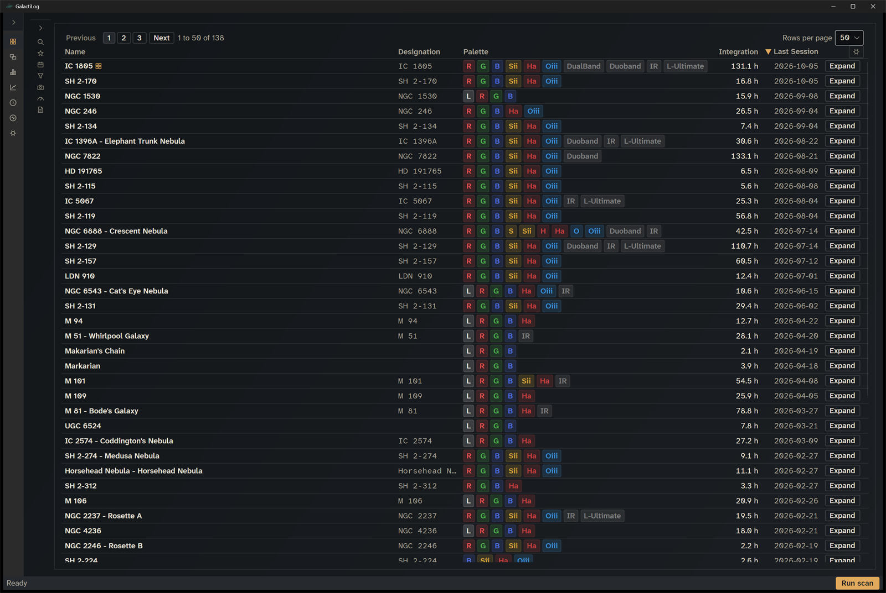
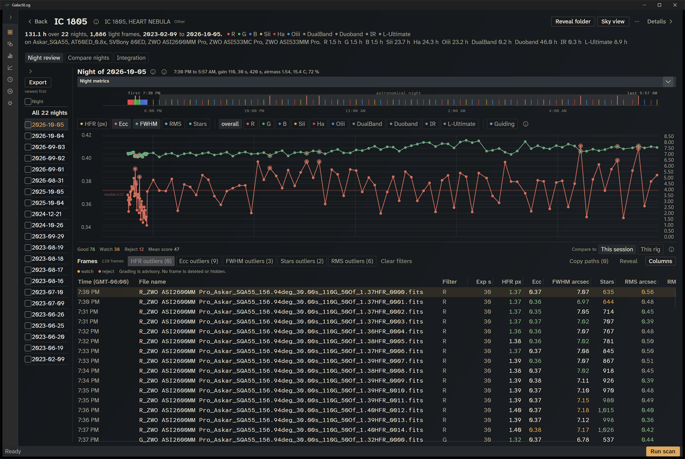
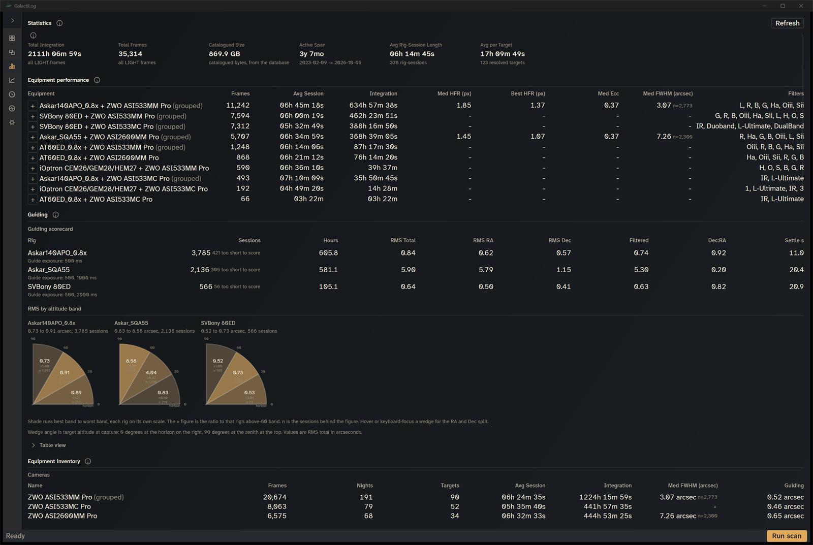
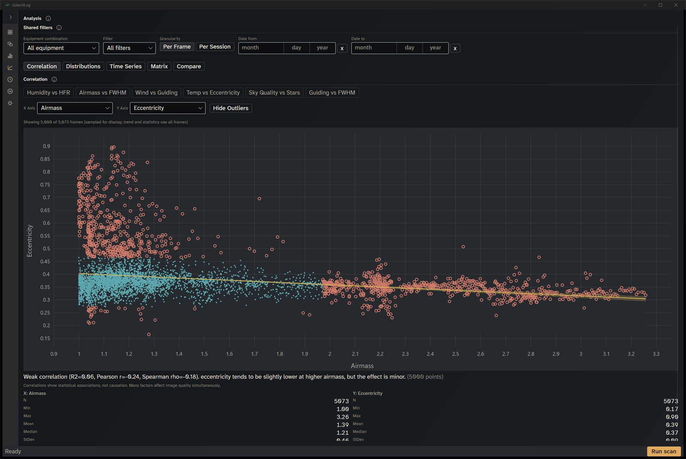
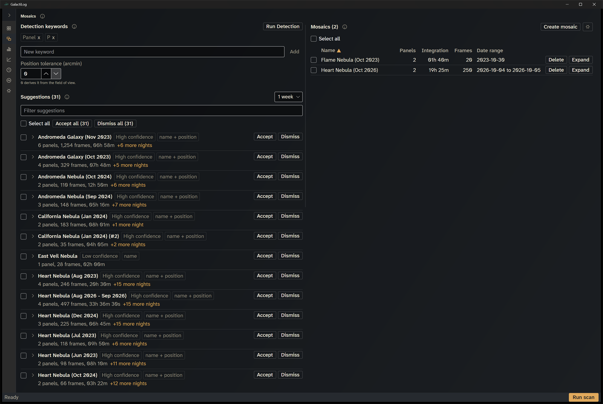
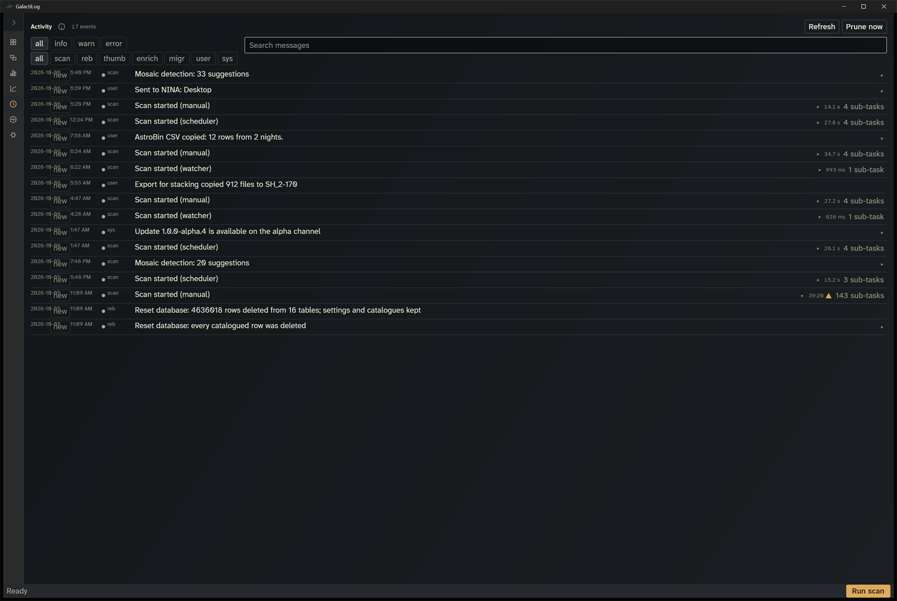
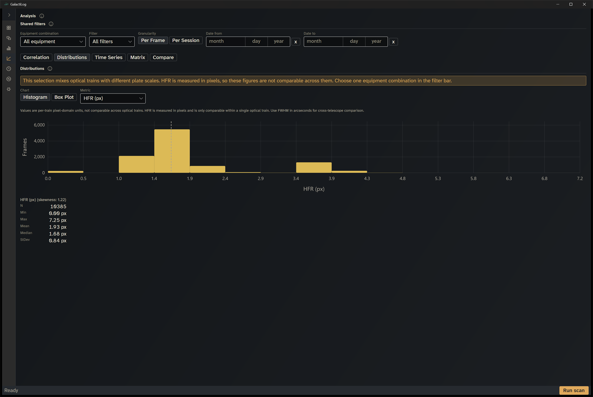
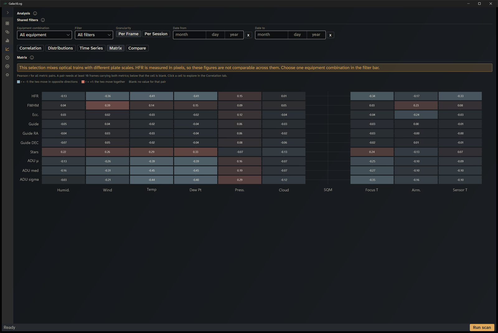
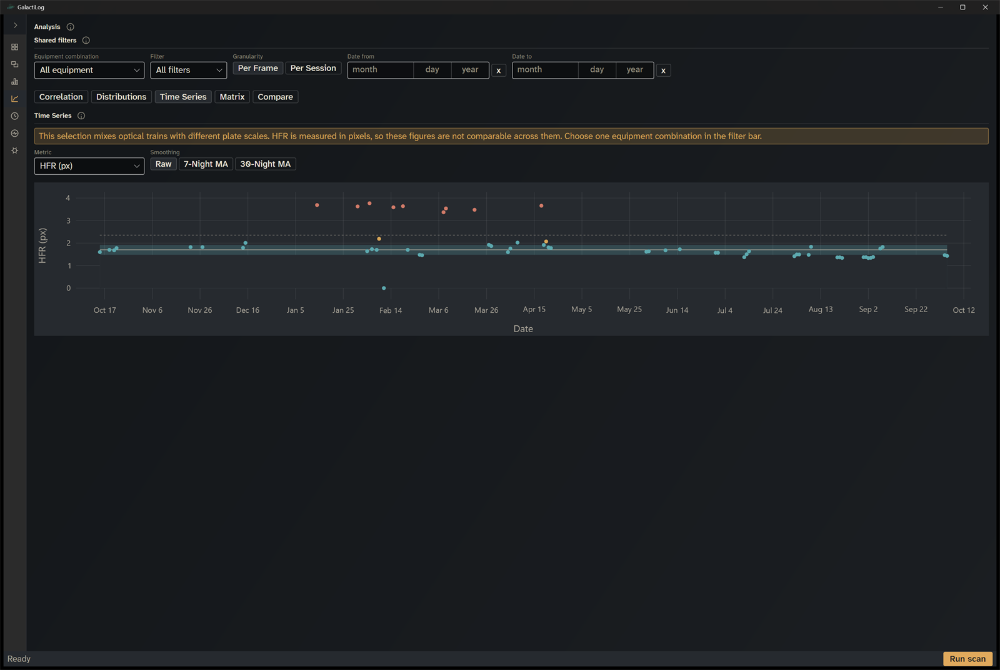
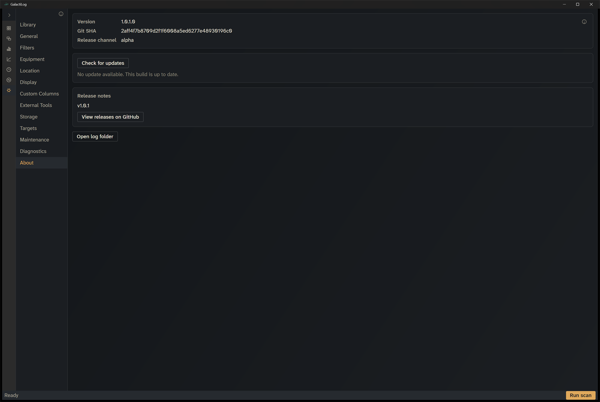

# GalactiLog Desktop

Windows desktop session logger for astrophotography. Indexes the FITS and XISF frames N.I.N.A. writes, the PHD2 guide logs beside them, and turns a folder tree into targets, nights, quality metrics and guiding figures.

[Releases](https://github.com/chvvkumar/GalactiLog-Desktop/releases) | [Installation](#installation) | [Features](#features) | [Command line](#command-line) | [Building from source](#building-from-source)



## Overview

GalactiLog walks the library folders you choose, reads the headers of every light and calibration frame, and keeps the result in a local SQLite catalogue. Your image files are the source of truth. The catalogue is an index built from them, and a rescan rebuilds it at any time. There is no server, no account and no cloud component. One installer and one process, with a tray icon.

> [!IMPORTANT]
> GalactiLog only reads your image files. It never deletes, moves, renames or edits anything in your library. Its own catalogue, thumbnails and logs live in a separate folder. It copies files only when you export frames for stacking, into a folder you choose outside your library.

## Features

**Dashboard.** Every target in the library with integration totals, frame counts and the latest night. Filter by object type, date range, filter, equipment, metric quality, FITS header values and custom columns, search by name, and open a target with one click.

**Target detail.** The catalogue record, notes, a list of nights with per-night totals, and three modes: Night review, Compare nights and Integration. Per-frame grading against the median of the same telescope, camera and filter, guiding RMS from the matching PHD2 session, metric trends across nights, the raw FITS header panel, a frame preview at the configured resolution up to native, and a Sky view fetched from CDS hips2fits.



**Statistics.** Aggregate figures across the whole library: overview, equipment performance, guiding, equipment inventory, filter usage, top targets, a timeline or calendar with dark hours, data quality, storage and ingest history.



**Analysis.** One set of shared filters feeding five tabs: Correlation scatter of two metrics, Distributions as histogram or box plot, Time Series of a nightly median, a Matrix of Pearson correlations, and Compare for two groups side by side.



**Mosaics.** Group the panels of one large field. Every scan suggests candidate mosaics, or run detection on demand. A mosaic page shows its panels, nights, an arranger for panel layout and a composite lightbox.

**Activity and Diagnostics.** A newest-first log of everything the application did, with severity and category filters, and a diagnostics page that reports the state of the installation and exports a bundle for a bug report.

**Export for stacking.** A wizard that copies the folders for the nights you check into a staging folder, optionally filtered by quality, or writes a PowerShell or Bash script that does the same. The wizard writes nothing until you commit on the Review step.

**Integrations.** Send a target's coordinates and rotation to N.I.N.A. through its Advanced API, slew Stellarium through its Remote Control plugin, export an AstroBin acquisition CSV, and copy frame lists to the clipboard as paths, file names or an Explorer search string.

### Supported inputs

| Input | Details |
| --- | --- |
| FITS | `.fits`, `.fit`, `.fts`. Primary header, BITPIX 8 to 64 and float, thumbnails from pixel data. The scanner skips compressed FITS and logs a warning. |
| XISF | `.xisf` monolithic files. XML header, FITS keywords and XISF properties, CFA patterns, zlib, LZ4 and LZ4HC blocks. |
| Calibration frames | BIAS, DARK, FLAT, DARKFLAT and BIASFLAT, when "Include calibration frames" is on. |
| N.I.N.A. ImageMetaData CSV | The scanner merges the CSV from the frame's folder into the frame metadata. |
| PHD2 guide logs | `PHD2_GuideLog_*.txt` anywhere under a library folder. RMS per section excluding dither and settle windows, equipment profile, pixel scale and algorithms. Sessions correlate to frames by time. |
| Catalogues | Bundled, offline: OpenNGC (with Messier cross-references), Caldwell, Herschel 400, Abell, Arp, SAC and Stellarium common names. SIMBAD and Sesame look up names the bundled catalogues do not contain. |

Quality metrics read from headers or file names: median HFR, FWHM, eccentricity, detected stars, guiding RMS (total, RA, Dec) and median ADU. Grading places each frame in one of four bands by its MAD-z distance from the group median.

## Installation

1. Download `GalactiLog-<channel>-Setup.exe` from [Releases](https://github.com/chvvkumar/GalactiLog-Desktop/releases). Most users want `stable`; the channels are listed below.
2. Run it. The installer is per user and needs no administrator rights. It places the application under `%LOCALAPPDATA%\GalactiLog`.
3. Complete the setup wizard: choose the library folders to scan, where the catalogue lives, your observer location and the scan schedule, then run the first scan.

The package is self-contained for Windows x64. No separate .NET runtime install is required.

GalactiLog checks GitHub Releases at start and every six hours, downloads a new package in the background, and asks before installing and restarting. It never installs while a scan is running. Releases come in three channels, and an installation only follows its own channel:

| Channel | Branch | Version shape |
| --- | --- | --- |
| stable | `main` | `1.0.1` |
| rc | `dev` | `1.0.1-rc.3` |
| alpha | `snd` | `1.0.1-alpha.7` |

> [!NOTE]
> The first scan reads every file it finds and takes far longer than later scans, which read only files that are new or changed. A folder watcher, on by default, picks up frames that arrive between scheduled scans, so GalactiLog can run on the imaging PC while N.I.N.A. is capturing.

### Where GalactiLog keeps its files

| Item | Location |
| --- | --- |
| Catalogue, settings and logs | `%LOCALAPPDATA%\GalactiLogData` by default, relocatable from Settings, Storage |
| Thumbnail and preview cache | `thumbnails` inside the data folder by default, relocatable |
| Application binaries | `%LOCALAPPDATA%\GalactiLog\current` |

Uninstalling removes the binaries and leaves the data folder in place. Set the `GALACTILOG_APPDATA` environment variable to point a run at a different data folder; two libraries can run side by side this way.

### Network use

Everything works offline except name resolution for unknown targets (SIMBAD and Sesame), the Sky view images (CDS hips2fits, switchable off under Settings, General), update checks (GitHub), and the N.I.N.A. and Stellarium instances you configure yourself. GalactiLog opens no listening ports.

## Command line

The same executable serves as a command line tool when given an argument. From an installed build:

```
%LOCALAPPDATA%\GalactiLog\current\GalactiLog.exe <command> [options]
```

| Command | Description |
| --- | --- |
| `scan [<path>...]` | Scan the configured roots, or the given directories, for new or changed files. Ctrl+C cancels. |
| `resolve <name>` | Look up a target name in the catalogues and online services and print which source matched. Never creates a target. |
| `inspect <file>` | Print the extracted metadata for one FITS or XISF file, and where each value came from. |
| `dump-headers <file>` | Print every raw header card of one FITS or XISF file. |

`--json` emits one JSON object on stdout. `--quiet` suppresses progress but never the result. `inspect` and `dump-headers` do not open the database, so they work while the desktop application is running. Exit codes: 0 success, 1 nothing resolved, 2 bad arguments, 3 input error, 4 database error, 5 cancelled, 6 data location unavailable, 70 unhandled error.

A second launch of the desktop application while one is running brings the existing window forward and exits. `--minimized` starts it in the notification area, which is how the Start with Windows shortcut launches it.

## Building from source

Requirements: Windows x64 and the .NET SDK 10.0.

```
git clone https://github.com/chvvkumar/GalactiLog-Desktop.git
cd GalactiLog-Desktop
dotnet build -c Release
dotnet test --no-build -c Release
```

Run against a throwaway data folder so a development build never touches your real catalogue:

```powershell
$env:GALACTILOG_APPDATA = "$env:TEMP\galactilog-dev"
dotnet run --project src/GalactiLog.App -c Release
```

The solution has four source projects and four test projects:

| Project | Role |
| --- | --- |
| `GalactiLog.Core` | FITS and XISF readers, PHD2 parser, metrics, catalogues, resolver, integrations. No UI, no database. |
| `GalactiLog.Data` | SQLite catalogue through EF Core: entities, migrations, ingest, queries, maintenance. |
| `GalactiLog.Cli` | The command line commands and their exit codes. |
| `GalactiLog.App` | The Avalonia desktop application: views, view models, tray, updates, host. |

Tests use xunit; the App tests render views with Avalonia.Headless. Warnings are errors and Avalonia bindings are compiled, so a binding path typo fails the build.

Packaging and installer builds use Velopack. Pushes to `snd`, `dev` and `main` build, test, pack and publish a release automatically on a self-hosted runner; a script derives the version from git tags, so there is no version field to edit.

## More screenshots

| Mosaics | Activity |
| --- | --- |
|  |  |

| Analysis, Distributions | Analysis, Matrix |
| --- | --- |
|  |  |

| Analysis, Time Series | Settings, About |
| --- | --- |
|  |  |
